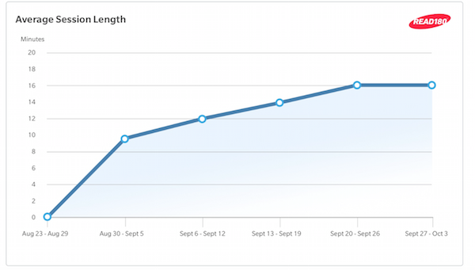

# PSI-9-Planning

__New Visualization: Linear Chart__
  * Standalone html for inovation exploration
  * Wrap in Directive
  * 
  
__New Toolbar (used by Leader Central)__
  * Buttons driven by new TLSP api
  * 

__Report Infrastructure__
  * New Report Service (used by Leader Central)
  * New Report Directive (used by Leader Central)

__Table Model Refactor__ 
  * Goal : simplify html of table
  * Goal : enable table consumer to access rows, columns, cells easier (more detail needed here)
  * Goal (?) : generalize hover behavior
  * Potential Strategy : Classes - e.g. "tableModel.getColumns()"  

__Common/Shared Report Service__
  * Goal : reduce code duplication
    - InsertLineBreaks
    - Initialize Intellify
    - (there are more here ...)

__Service Caching__
  * cache data per class and session
  * E3D gets all data up front for dropdown ...

__Additional Service Refactoring__
  * What are the goals here?

__New Visualization : Multiple Vertical Bar Chart__

__Bugs__

__Simulator Redirect__
  * Goal : Make it clearer and cleaner to redirect to any desired server
    - support full name
    - support x for regex(0*) e.g. h502x1 or h502x11

__Responsive D3 Visualizations__
  * Visualization svg should respond to window resize

__CSS/LESS Overhaul__
  * less files per report
  * common report css file
  
__Unit testing__
  * make one useful unit test
  * make ten useful unit tests
   
